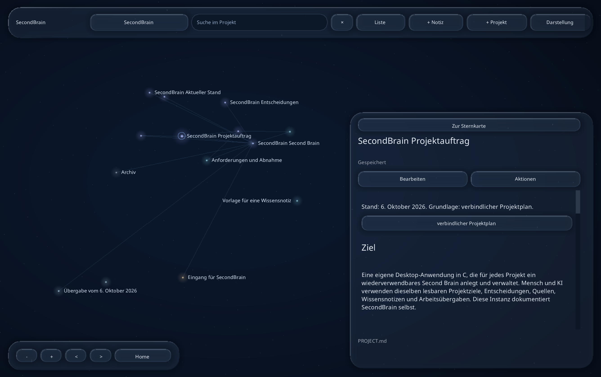

# SecondBrain

[](https://github.com/Lulus792/SecondBrain/actions/workflows/tests.yml)

Dein Projektwissen an einem Ort: Ziele, Notizen, Entscheidungen und Quellen.
SecondBrain ist eine Desktop-App für Windows, macOS und Linux, geschrieben in C.
Jedes Projekt bekommt ein eigenes Gedächtnis, das du und eine KI gemeinsam nutzen
könnt. Die Dateien bleiben als Markdown und kleine JSON-Metadaten lesbar.



**In Entwicklung.** Die lokale Arbeit mit Projekten ist umgesetzt. Die App hat
noch keinen stabilen 1.0-Release. Aktuelle Nachweise stehen im
[Umsetzungsstand](docs/STATUS.md), offene Aufgaben in der [Release-Liste](docs/RELEASE.md).
Die Vorschau oben stammt aus der echten C-App.

## Was du damit machen kannst

- Projekte anlegen, zwischen ihnen wechseln und Wissen nach Bereichen ordnen.
- Notizen schreiben, bearbeiten, durchsuchen und archivieren.
- Dokumente als Sterne erkunden; Linien zeigen vorhandene interne Markdown-Links.
- Lokale Quellen und verlinkte Ordner direkt in der App lesen.
- Gespeicherten Projektkontext für einen KI-Chat kopieren.
- Projekte sichern, Sicherungen prüfen und unter einem freien Namen wiederherstellen.
- Die App vollständig mit der Tastatur bedienen.

Die dunkle Lumen-Oberfläche verbindet leuchtende Sterne mit schwebenden
Glaskarten. Schriftgröße, helle Darstellung, reduzierte Transparenz und reduzierte
Bewegung lassen sich in den Einstellungen wählen. Die Glasdarstellung ist eine
eigene Umsetzung nach Apple-Vorbild.

## Starten

Die [Vorabversion v0.7.3](https://github.com/Lulus792/SecondBrain/releases/tag/v0.7.3)
ist für Windows x64, macOS auf Apple Silicon und Intel sowie Linux x64 verfügbar.
Lade das passende ZIP oder tar.gz herunter und entpacke es. `QUICKSTART.txt`
erklärt den Start; `SHA256SUMS` enthält die Prüfsummen. Diese Vorabversion ist
noch kein stabiler 1.0-Release.

Neuere Entwicklungsstände findest du als befristete Pakete in den
[GitHub-Actions-Läufen](https://github.com/Lulus792/SecondBrain/actions/workflows/tests.yml):
`SecondBrain-Windows-X64`, `SecondBrain-macOS-ARM64`,
`SecondBrain-macOS-X64` und `SecondBrain-Linux-X64`. Entpacke den Download
und das enthaltene Anwendungsarchiv. Diese Downloads erfordern unter Umständen
einen GitHub-Login und bleiben 30 Tage verfügbar.

Ohne Argumente verwendet die App `SecondBrain` in deinem Benutzerordner.
Beim ersten Start führt **Neues Projekt** direkt zum eigenen Gedächtnis.
**Arbeitsordner öffnen** und **Sicherung wiederherstellen** bieten die anderen
Einstiegswege. Bei geöffnetem Projekt findest du sie in der Projektwahl. Über die Projektwahl
oder Command/Control+O kannst du einen bestehenden Arbeitsordner öffnen.
Ein externer Wissenseditor und Python sind für die App nicht erforderlich.

Die Pakete sind noch nicht mit Herausgeberzertifikaten signiert oder durch Apple
notarisiert. Voraussetzungen und Paketaufbau: [Distribution](docs/DISTRIBUTION.md).

## Selbst bauen

Du brauchst einen C17-Compiler und CMake ab 3.24. Auf macOS eignet sich der
Compiler der Xcode Command Line Tools, auf Windows Visual Studio mit C-Werkzeugen,
auf Linux GCC oder Clang sowie die Entwicklungsdateien des Fenstersystems.
SDL3 und die UI-Textbibliotheken werden bei Bedarf in festgelegten Versionen
beim Build geladen. HarfBuzz benötigt zusätzlich einen C++-Compiler;
der eigene Anwendungscode ist C17.
Unter Windows und Linux benötigt der UI-Build zusätzlich Cargo mit Rust ab 1.87,
um die festgelegte Zugänglichkeitsbibliothek mit ihren UI-Korrekturen zu bauen.
Die fertige Anwendung benötigt keine Rust-Toolchain.
Die automatisierten Prozessprüfungen benötigen beim Bauen zusätzlich Python 3;
für einen reinen Anwendungsbuild kann `-DBUILD_TESTING=OFF` gesetzt werden.
[Plattformdetails](docs/DISTRIBUTION.md).

```sh
cmake -S . -B build/app -DCMAKE_BUILD_TYPE=Release
cmake --build build/app --config Release --parallel 4
ctest --test-dir build/app -C Release --output-on-failure
```

| System | Anwendung |
| --- | --- |
| macOS | `build/app/secondbrain.app` |
| Windows, Visual Studio | `build/app/Release/secondbrain.exe` |
| Linux | `build/app/secondbrain` |

Starte die Anwendung per Doppelklick. Um das Projektgedächtnis dieses Repositories
zu öffnen, verwende im Terminal aus dem Repository-Ordner:

```sh
# macOS
build/app/secondbrain.app/Contents/MacOS/secondbrain --workspace brains --project secondbrain
# Linux
build/app/secondbrain --workspace brains --project secondbrain
```

```powershell
# Windows
.\build\app\Release\secondbrain.exe --workspace brains --project secondbrain
```

## Bedienung

| Aktion | Taste |
| --- | --- |
| Bedienelement wechseln | Tab / Umschalt+Tab |
| Werkzeuge, Sternkarte, Dokument wechseln | F6 / Umschalt+F6 |
| Nächste Notiz in der Sternkarte sofort öffnen | Pfeiltasten |
| Kamera drehen | Umschalt+Pfeile |
| Zoomen / Kamera zurücksetzen | +, − / Pos1 |
| Lesebereich scrollen | Bild auf / Bild ab |
| Vorherige / nächste Überschrift in der Leseansicht | Alt+Bild auf / Bild ab |
| Aktionen öffnen / darin wechseln | Umschalt+F10 / Pfeile auf und ab |
| Speichern / Suche / Bearbeiten | Command/Control+S / F / E |
| Neue Notiz / neues Projekt | Command/Control+N / Umschalt+N |
| Zurück oder abbrechen / Hilfe | Escape / F1 |

Command gilt auf macOS, Control auf Windows und Linux. Tab verlässt auch den
Editor; Ctrl+I fügt dort einen Tabulator ein.
Zusammengesetzte Zeichen werden beim Bewegen, Auswählen und Löschen als Einheit
behandelt. [Eingabevertrag und Grenzen](docs/GRAPHEME.md). Mit der Maus: Ziehen dreht die
Sternkarte, Umschalt+Ziehen verschiebt sie, das Mausrad zoomt. Über einer Karte
scrollt es den Inhalt. Weitere Kürzel stehen in der eingebauten Hilfe und im
[Tastaturvertrag](docs/UI_TASTATUR.md).

Der letzte Arbeitsordner, das Projekt, die Notiz und deine Darstellung werden
beim regulären Beenden gespeichert. „Arbeitsordner öffnen“ bietet eine native
Ordnerauswahl. [Details und Grenzen](docs/EINSTELLUNGEN.md).

„Projekt sichern“ liegt unter Aktionen. „Sicherung wiederherstellen“ findest du
auch unter Projekte. Die App prüft den Inhalt vor der Wiederherstellung und
erhält bestehende Projekte. [Ablauf und Grenzen](docs/SICHERUNG.md).

„Groß lesen“ erweitert die Leseansicht auf die verfügbare Fläche. Die Bereichswahl
bleibt auch nach dem Öffnen eines Archivdokuments erreichbar.

Die Leseansicht unterstützt eigene [Markdown-Blockregeln](docs/MARKDOWN.md)
für Überschriften, Code, Absätze und [Tabellen](docs/TABELLEN.md).
[Hervorhebungen und Inline-Code](docs/INLINE_STILE.md) bleiben dabei sichtbar;
[Zeichenreferenzen](docs/ENTITIES.md) werden im Lesetext und in Inline-Linkzielen dekodiert. Den noch begrenzten Umfang dokumentiert
der Vertrag; der Editor erhält den Originaltext. [E-Mail- und URI-Autolinks](docs/AUTOLINKS.md) erhalten bedienbare Ziele.
[Referenzlinks](docs/REFERENZLINKS.md) verwenden Definitionen aus derselben Datei.
[Gemeinsame Linkregeln](docs/INLINE_LINKS.md)
verhindern falsche Aktionen und Sternkartenverbindungen aus Codebeispielen.

Vor einem Dokumentwechsel oder dem Beenden fragt die App nach ungespeicherten
Änderungen. Bei einer extern geänderten Datei kannst du deine Fassung als neue
Notiz sichern, ohne die fremde Fassung zu überschreiben.

## Dein Projektgedächtnis

`START.md` führt durch Auftrag, Stand, Entscheidungen, offene Fragen und Quellen.
`knowledge/`, `inbox/`, `journal/` und `archive/` enthalten die weiteren Notizen.
Trage zuerst Ziel und Erfolgskriterien in `PROJECT.md` ein und ergänze die
Originalquellen in `SOURCES.md`.

Ein KI-Chat kann die Dateien direkt lesen oder den kopierten Kontext verwenden.
Die Pflege beauftragst du ausdrücklich; sie erfolgt noch nicht automatisch.
Das [eigene Projektgedächtnis](brains/secondbrain/START.md) zeigt die Struktur
im Einsatz. [Konzept und Arbeitsweise](docs/KONZEPT.md).

## Entwicklung

Der fachliche Kern verwendet C und Betriebssystem-APIs. SDL3, Nuklear, SDL_ttf und AccessKit
werden für die UI eingesetzt. Die Herkunft und Lizenzen der Abhängigkeiten stehen unter
[third_party](third_party/README.md); die Architektur in [docs/ARCHITEKTUR.md](docs/ARCHITEKTUR.md).
Dateiformate und Updateverhalten stehen im [Datenvertrag](docs/DATENVERTRAG.md).
Der eigene Code steht unter der [MIT-Lizenz](LICENSE). Für die UI-Abhängigkeiten
und Schriften gelten ihre jeweiligen mitgelieferten Lizenzen.

Den Kern kannst du separat bauen:

```sh
cmake -S . -B build/core -DSB_BUILD_UI=OFF -DCMAKE_BUILD_TYPE=Debug
cmake --build build/core --config Debug
ctest --test-dir build/core -C Debug --output-on-failure
```

`secondbrain-cli` unterstützt `new`, `list`, `search`, `context` sowie
`backup`, `inspect` und `restore`. [Sicherungsvertrag](docs/SICHERUNG.md).
Der ältere Python-Generator ist als [Strukturprototyp](docs/STRUKTURPROTOTYP.md)
dokumentiert. Neue Vorlagen überschreiben keine bestehenden Instanzen.
Abgeschlossene, geprüfte Arbeitsschritte werden committet und nach GitHub gepusht.

- [Projektplan und Todos](docs/PROJEKTPLAN.md)
- [Aktueller Stand und Plattformnachweise](docs/STATUS.md)
- [Aufgaben bis zum vollständigen Release](docs/RELEASE.md)
- [UI-Recherche](docs/UI_RECHERCHE.md) und [Gestaltung](docs/UI_GALAXIE.md)
- [Grundlagen des Second-Brain-Konzepts](docs/GRUNDLAGEN.md)

Ab 0.8.0 kannst du unter **Darstellung → Über SecondBrain** die Version ansehen und
die Buildangaben kopieren. Im Terminal zeigen App und CLI mit `--version`
dieselben Angaben, ohne einen Arbeitsordner zu öffnen. Unter **Lizenzen** lassen sich
ab 0.9.3 die mitgelieferten Originaltexte direkt in der App lesen und kopieren.
[Bedienung und Umfang](docs/LIZENZEN.md).

Fehlerberichte sollten Betriebssystem, Version, Schritte zum Wiederholen und das
beobachtete Verhalten enthalten. [Hilfe und Fehlermeldungen](SUPPORT.md),
[Mitarbeit](CONTRIBUTING.md) und [GitHub Issues](https://github.com/Lulus792/SecondBrain/issues).
