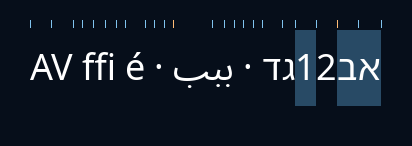

# Cursorpositionen aus der geformten Zeile

Stand: 8. Oktober 2026. Die neue C-Geometrie ergänzt den
[Glyphenplan](GLYPHENGEOMETRIE.md) um Cursorpunkte, Mauszuordnung und visuelle
Auswahlflächen. Sie ist zunächst als gemeinsame Grundlage geprüft. Der
produktive Editor und die nativen Zeichenrechtecke verwenden sie noch nicht;
die installierte App bleibt 0.9.34 / 4eda9dbfce37.

## Warum der bisherige Einzelzeichenweg nicht genügt

Einzelbreiten addieren sich bei Kerning und Ligaturen nicht zur geformten Zeile.
Bei gemischten Schreibrichtungen kann dieselbe logische Textgrenze außerdem zwei
verschiedene visuelle Positionen haben. Die bestehende Nuklear-Eingabe und ihre
Mauszuordnung brauchen deshalb dieselbe vollständige Zeile wie die Zeichnung.
Originaltext, logische Auswahl und Undo sollen dabei erhalten bleiben.

Erneut eingesehene Originale:
[UAX #9, Revision 52](https://www.unicode.org/reports/tr9/tr9-52.html) für Absatz-
und visuelle Zeilenreihenfolge sowie
[HarfBuzz GDEF-Ligaturpositionen](https://harfbuzz.github.io/harfbuzz-hb-ot-layout.html#hb-ot-layout-get-ligature-carets).
Die GDEF-Positionen sind ungeformte Schriftkoordinaten. Der eigene Plan setzt sie
an die tatsächliche Glyphenposition der geformten Zeile; dadurch wird eine vor
der Ligatur wirksame Verschiebung berücksichtigt. Die folgende Cursorpolitik
ist eine eigene UI-Entscheidung, kein zusätzlicher normativer Unicode-Algorithmus.

## Daten und Regeln

[app/carets.h](../app/carets.h) erhält den vorbereiteten Absatz und seine schon
geformte Zeile. Graphemgrenzen stammen aus derselben Vorbereitung. Fonts und
Glyphen werden weder geändert noch neu nach Einzelzeichen geformt.

- Jeder Cursorpunkt hält logischen UTF-8-Offset, x in Backing-Pixeln,
  Einbettungslevel und seine Seite am angrenzenden Graphem.
- BEFORE meint vor dem folgenden logischen Graphem, AFTER nach dem vorherigen.
  Gleiche Quellgrenzen mit verschiedenen visuellen Positionen bleiben erhalten.
  Nur gleiche Position, Quelle und Level werden zu BOTH zusammengefasst.
- Eine vollständige Graphemeinheit wird nie geteilt. Akzentfolgen, Emoji-ZWJ,
  Flaggen und Hautfarben erhalten keine inneren Cursorpunkte.
- Ligaturen mit mehreren Graphemen benutzen passende, geordnete und innerhalb
  des Clusters liegende GDEF-Positionen. Fehlende/unpassende Tabellen oder mehrere
  Glyphen im Cluster verwenden proportional verteilte Positionen. Diese
  Annäherung ist ausdrücklich als PROPORTIONAL markiert; ADVANCE und GDEF bleiben
  unterscheidbar. Sie belegt keine vollständige Schriftabdeckung.
- Quell- und visuelle Indizes erlauben binäre Suche statt Vollscans für normale
  Positionsabfragen. Gleichliegende Punkte werden bei einer visuellen Bewegung
  übersprungen; die nächste Taste bewegt sich an eine andere x-Position.
  An Richtungsgrenzen bleibt die explizite Affinität erhalten.
- Die Maus wählt den nächsten visuellen Punkt, begrenzt an den Zeilenrändern.
  Bei gleicher Entfernung bevorzugt die Auflösung die Absatzrichtung.
- Eine logische Auswahl wird in Flächen ihrer ausgewählten Grapheme zerlegt.
  Sie kann wegen der Schreibrichtungen mehrere getrennte Bereiche belegen.
  Nur ausgewählte Bereiche werden allokiert; Originalbytes bleiben erhalten.
- Leere LTR-/RTL-Absätze erhalten einen passenden Cursorpunkt bei x=0.
  Ein leerer Bereich in einem nichtleeren Absatz bleibt ein unzulässiger
  Zeilenauftrag. Fehler erhalten die leere Ausgabe; Pläne werden explizit freigegeben.

Die Ergebnisarrays enthalten keine Fontzeiger und können nach dem Freigeben der
Vorbereitung gelesen werden. Text-, Font-, Dichte- und Layoutänderungen benötigen
neue Geometrie; für die folgende UI-Anbindung ist diese Invaliderung verbindlich.
Eine Zeile beschreibt nur horizontale Positionen. Die endgültige UI muss den
Zeilenursprung, Grundlinie, Clip und Scrollposition dazugeben und genau einmal
von Backing-Pixeln in Fensterpunkte umrechnen.

## Lokale Prüfung

Die neue C-Prüfung verwendet tatsächliche Noto-Fonts bei 18/27/36 Punkten:
Kerning/Ligaturen, Akzente, verbundene arabische Buchstaben, Hebräisch neben
Latein und Ziffern, Isolate, komplette Emoji-Grapheme, RTL-Fortsetzungszeilen,
Affinität, ungültige Bereiche und leere Absätze. Geordnete Punkte, vollständige
Quellabdeckung und Auswahlbreiten werden gegen den bestehenden Glyphenplan geprüft.

Die im festgelegten Noto-Sans-Original mit FontTools 4.60.1 unabhängig gelesenen
GDEF-Koordinaten für `f_f_i` sind 315 und 631 bei 1000 Einheiten pro em. Der
C-Test prüft ihre skalierten Werte und Positionen im tatsächlich geformten Text;
es handelt sich nicht um angenommene gleiche Drittel. FontTools ist nur für diese
Quelleninspektion benutzt worden, keine neue Build- oder Runtime-Abhängigkeit.

Eine gerasterte Vorschau benutzt die tatsächlichen Glyphenbilder. Kleine Striche
zeigen Cursorpunkte; die Flächen markieren eine zusammenhängende logische Auswahl,
die visuell in zwei getrennte Bereiche fällt. Die Vorschau wurde betrachtet;
sie ist eine Geometrieprüfung, keine neue Editoransicht.

Ein zusätzlicher Fall erzeugt eine Zeile mit 20.000 Zeichen und fragt 100.000-mal
Quellposition, Maustreffer und nächsten visuellen Punkt ab. Die gemessene Dauer
wird berichtet, ohne eine hardwareabhängige Zeit als Bestehensgrenze zu verwenden.
Konkrete Gesamt-/Sanitizer- und Plattformnachweise stehen in [STATUS](STATUS.md).

## Nächste Integration

Nuklear-Eingabe, Maus, Pfeile, vertikale Bewegung, Caret, Auswahl und Zeichnung
müssen diese Geometrie gemeinsam verwenden. Dazu gehören Suche/Formulare, lange
Zeilen, Zeilenwechsel, Schrift-/Dichte-Invaliderung, IME-Komposition und native
Zeichenrechtecke. Die neue C-Grundlage allein ist kein fertiger Editor und ersetzt
keine echte Eingabemethoden- oder menschliche Screenreader-Abnahme.
